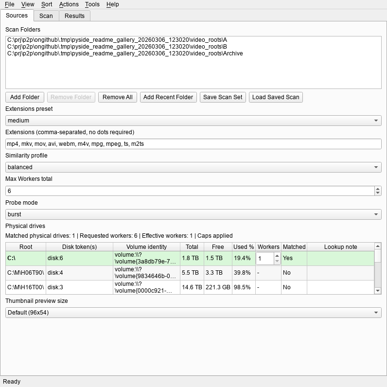
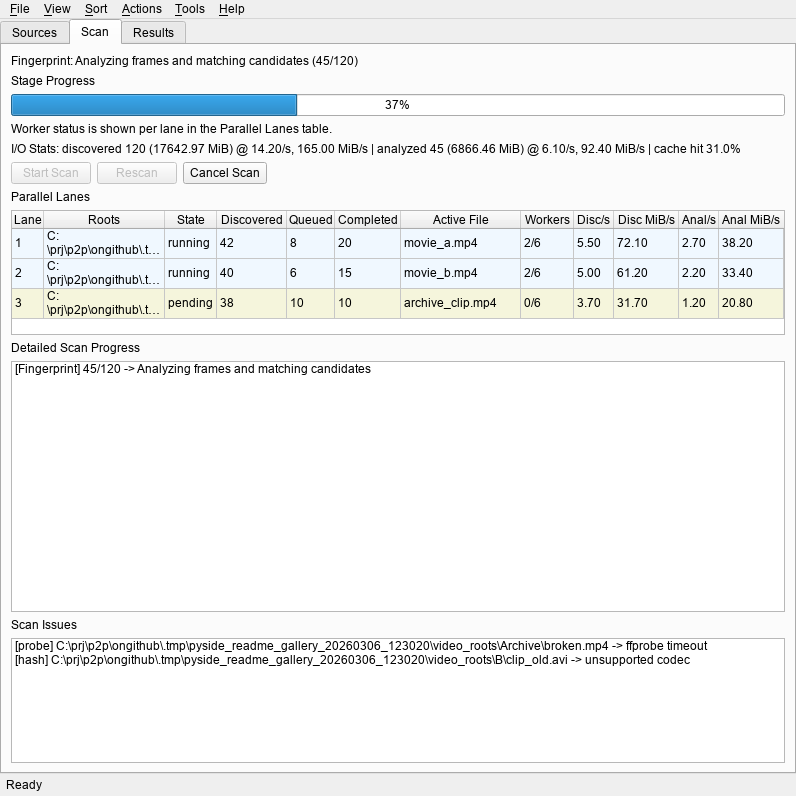
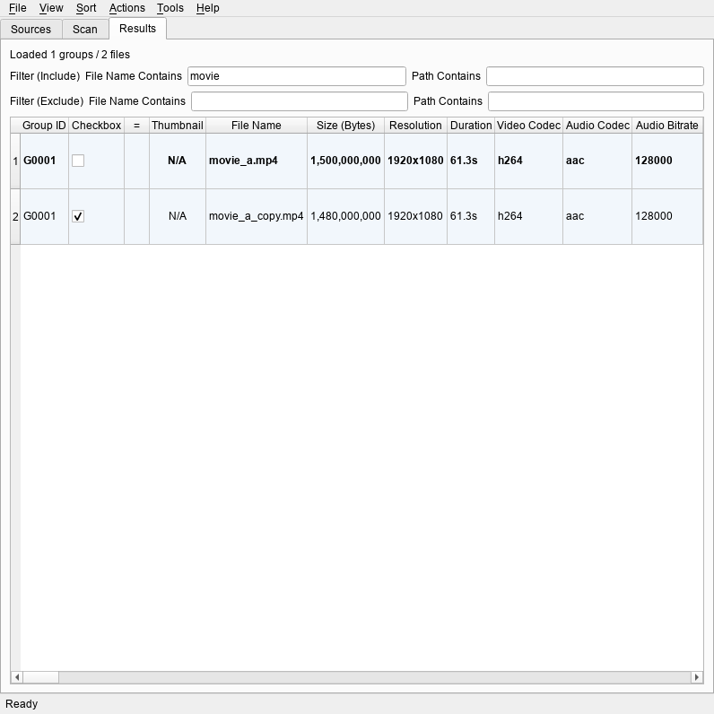

# Video Duperz

A Windows-first PySide6 app for finding perceptual duplicate videos using dhash fingerprinting, with physical drive-aware parallel scanning and quality-based keep decisions.

## Table of Contents

- [Features](#features)
- [UI Walkthrough](#ui-walkthrough)
- [Requirements](#requirements)
- [Installation](#installation)
- [Usage](#usage)
- [Configuration](#configuration)
- [Keyboard Shortcuts](#keyboard-shortcuts)
- [Menus](#menus)
- [Project Structure](#project-structure)
- [Architecture](#architecture)
- [Development](#development)
- [Troubleshooting](#troubleshooting)
- [Legal Disclaimer](#legal-disclaimer)

## Features

- **Perceptual duplicate detection** - dhash (difference hash) algorithm with 12 frame samples across video duration
- **Three similarity profiles** - Conservative (0.12), Balanced (0.18, default), Aggressive (0.24) thresholds
- **Physical drive-aware scanning** - maps root folders to physical drives and allocates worker threads per drive for optimal I/O
- **Intelligent pre-filtering** - candidates filtered by duration (+-2s), resolution aspect ratio, and frame rate before full distance computation
- **Quality-based keep decisions** - scores files by resolution (65%), bitrate (25%), and codec quality (10%) to determine which duplicate to keep
- **Exact match detection** - byte-level identical file detection using configurable block sampling
- **Live scan monitoring** - real-time progress per lane showing discovered/analyzed files, I/O throughput, cache hit ratios, and active file
- **Thumbnail pair caching** - extracts and caches video thumbnails at configurable frame positions
- **Duplicate group management** - decision-focused UI for bulk actions (keep best, worst, larger, smaller, newer, older)
- **Export to CSV/JSON** - scan results exportable for external analysis
- **Saved scan profiles** - save and restore source configurations and scan parameters
- **Saved column views** - preserve result table column layouts and visibility

## UI Walkthrough

1. Configure sources and scan profiles before indexing.

   

   Sources setup state for defining roots, extension presets, and worker settings.

2. Monitor scan progress and throughput across lanes.

   

   Workflow state for active scan progress, queue depth, and processing lanes.

3. Review duplicate groups and choose a cleanup decision.

   

   Decision-focused duplicate results state for keep/remove/export actions.

## Requirements

- **Windows** (10 or later)
- **Python 3.13+**
- **ffmpeg** and **ffprobe** (from ffmpeg suite) installed and available in PATH

Runtime dependencies: `PySide6 >=6.10.2`, `numpy >=2.4.2`, `opencv-python >=4.13.0.92`, `av`.

## Installation

### First-time Setup

```bat
python scripts\windows\setup_env.py
```

Creates the `.venv` by running `uv sync --locked` (falls back to `uv sync` if no lockfile).

Manual alternative for development:

```bat
uv sync --group dev
```

Install ffmpeg if needed (Windows):

```bat
:: via package managers:
choco install ffmpeg
scoop install ffmpeg
winget install Gyan.FFmpeg
```

## Usage

### Recommended (console-less)

```bat
pyw scripts\windows\run_app_gui.pyw
```

Launches the GUI without a console window. Auto-bootstraps the `.venv` via `setup_env.py` if not yet created.

### With console

```bat
python scripts\windows\run_app.py
```

Runs via `hatch run python -m video_duperz`. Requires `hatch` in PATH.

### Direct (GUI)

```bat
python -m video_duperz gui
```

### CLI

```bat
:: Headless scan with profiles
python -m video_duperz scan --roots D:\Videos E:\Archive --profile balanced

:: Export results
python -m video_duperz export --scan-id 1 --out C:\temp\dup-report

:: Full reset (delete database, cache, and settings)
python -m video_duperz clean --full-reset

:: Full reset with relaunch
python -m video_duperz clean --full-reset --delay-ms 1500 --relaunch
```

`File > Full reset` in the GUI closes the app, runs the companion cleaner command, and relaunches after cleanup.

Global runtime overrides are available for all commands:

- `--config-dir <path>` - override QSettings INI root
- `--data-dir <path>` - override runtime data root (DB/cache/thumbnails)

## Configuration

Runtime settings are stored via QSettings:

- Backend: `QSettings(IniFormat, UserScope, "ThreepSoftwz", "video_duperz")`
- Default INI path: `%APPDATA%\ThreepSoftwz\video_duperz.ini`
- Default runtime data root: `%LOCALAPPDATA%\ThreepSoftwz\video_duperz\`
- Database: `%LOCALAPPDATA%\ThreepSoftwz\video_duperz\app.db` (SQLite with WAL mode)
- OV01 overrides:
  - `CONFIG_DIR` env var or `--config-dir`
  - `DATA_DIR` env var or `--data-dir`

### Key Settings

| Setting | Description |
|---|---|
| Scan roots | Directories to scan for video files |
| File extensions | Preset groups: basic, medium, broad |
| Similarity profile | balanced / conservative / aggressive |
| Max workers | 1-16, with per-drive overrides |
| Probe worker mode | balanced / burst |
| Thumbnail size | 80x45, 96x54, 128x72, 160x90 |
| Frame extraction positions | Two percentage points for thumbnail comparison |
| Identical file matching | Block size (1-64 MiB) and sample positions |
| Keep rule strategy | Quality scoring (resolution + bitrate + codec) |
| Batch size / flush intervals | Scan pipeline tuning parameters |

### Recent Folders

Up to 20 recently scanned folders are stored for quick access. Saved scan profiles are limited to 200.

## Keyboard Shortcuts

| Key | Action |
|---|---|
| Delete | Soft delete selected files |
| Shift+Delete | Permanently delete selected files |
| Enter | Open current file in default player |
| E | Open file location in Explorer |
| M | Launch MediaInfo for selected file |
| Ctrl+Q / Alt+X | Exit application |
| F1 | Help |

## Menus

**File**:
- Export Current Scan...
- Clear Recent Folders
- Clear Saved Scans
- Clear Cached Thumbnails
- Full Reset (destructive - launches separate cleaner process)
- Exit (Ctrl+Q, Alt+X)

**View**:
- Columns submenu:
  - Fit Columns
  - Save Current View
  - Saved Views (dynamic)
  - Per-column visibility toggles (19 columns)

**Sort** (mutually exclusive):
- Larger / Smaller size groups first
- Most / Least duplicates first
- Larger / Smaller files in group first
- Size difference (spread) DESC / ASC

**Actions**:
- Select all, keep best / worst / larger / smaller / newer / older
- Delete Selected
- Permanently Delete Selected

**Tools**:
- Edit .ini File

**Help**:
- Help (F1)

## Project Structure

```text
video-duperz/
|-- pyproject.toml
|-- uv.lock
|-- src/
|   `-- video_duperz/
|       |-- __init__.py              # Package version detection
|       |-- __main__.py              # CLI entry point (gui, scan, export, clean)
|       |-- config.py                # Settings management, QSettings wrappers
|       |-- models.py                # Data classes (Settings, ScanResult, etc.)
|       |-- db.py                    # SQLite database layer
|       |-- scanner.py               # File enumeration and physical drive detection
|       |-- pipeline.py              # Scan orchestration (enumerate/probe/fingerprint/match)
|       |-- analyze_process.py       # Per-file analyze child process protocol and launcher
|       |-- probe.py                 # PyAV/ffprobe metadata probing with fallback
|       |-- fingerprint.py           # dhash computation with OpenCV/PyAV/ffmpeg fallbacks
|       |-- matcher.py               # Duplicate edge detection and grouping
|       |-- quality.py               # Quality scoring for keep decisions
|       |-- exact_match.py           # Byte-level identical file detection
|       |-- scan_sets.py             # Scan configuration normalization
|       |-- exporters.py             # CSV/JSON export
|       |-- cleaner.py               # Full reset utility
|       `-- ui/
|           |-- main_window.py       # Main application window with menus and tabs
|           |-- scan_view.py         # Scan progress monitoring UI
|           |-- results_view.py      # Duplicate results table with actions
|           |-- thumbnails.py        # Thumbnail extraction and caching
|           `-- workers.py           # QRunnable workers for async operations
|-- scripts/
|   |-- policy/
|   |   `-- check_standard.py
|   `-- windows/
|       |-- setup_env.py              # Create/verify .venv via uv sync
|       |-- run_app.py               # Launch app via hatch run
|       |-- run_app_gui.pyw          # Launch GUI without console window
|       `-- run_tests.py             # Run tests via hatch run test
|-- docs/
|   |-- CHANGELOG.md
|   |-- dev-packaging.md
|   `-- images/
|       |-- ui-01-overview.png
|       |-- ui-02-workflow.png
|       `-- ui-03-details.png
|-- tests/
|   |-- conftest.py
|   |-- unit/
|   `-- integration/
`-- .pre-commit-config.yaml
```

## Architecture

- `src/` layout with `video_duperz` package.
- CLI entry point (`__main__.py`) dispatches to `gui`, `scan`, `export`, or `clean` commands.
- **Scan pipeline** (`pipeline.py`) orchestrates five stages:
  1. **Enumerate** - discover video files with physical drive-aware lane distribution
  2. **Analyze** - launch one hidden child process per file for metadata probing and fingerprint extraction
  3. **Probe** - extract metadata through the selected backend with automatic alternate-backend fallback inside the analyze child
  4. **Fingerprint** - compute 12 dhash values using OpenCV first, then PyAV and ffmpeg fallbacks for difficult files
  5. **Match** - bucket files by characteristics, find duplicate pairs, compute similarity scores
  6. **Results** - group duplicates and determine default keep file by quality score
- **Physical drive mapping** (`scanner.py`) uses Windows kernel32 APIs to map volumes to physical drives and allocate I/O workers per drive.
- **Database** (`db.py`) uses SQLite with WAL mode, aggressive PRAGMAs (mmap, cache_size, synchronous=NORMAL), and batch transaction flushing.
- **GUI threading** uses `QThreadPool` with `QRunnable`-based workers (`ScanWorker`, `ThumbnailPairWorker`, `ExactMatchGroupWorker`) communicating via Qt signals.
- **Analyze isolation** uses one hidden Python child process per file so timed-out or wedged probe/fingerprint work can be terminated robustly without leaving stuck worker threads behind.
- **Quality scoring** (`quality.py`) combines resolution (65%), bitrate (25%), and codec quality (10%) weights.

## Development

### Windows Helpers

| Script | Description |
|---|---|
| `python scripts\windows\setup_env.py` | Create/verify `.venv` via `uv sync --locked` |
| `pyw scripts\windows\run_app_gui.pyw` | Launch GUI without console window (auto-bootstraps venv) |
| `python scripts\windows\run_app.py` | Launch app via `hatch run` (requires hatch in PATH) |
| `python scripts\windows\run_tests.py` | Run test suite via `hatch run test` |

### Testing

```bat
hatch run test
```

### Quality Checks

```bat
hatch run lint:all
hatch run test-cov
```

Individual checks:

```bat
hatch run lint:check
hatch run lint:fmt
hatch run lint:types
hatch run lint:policy
```

### Build

```bat
hatch build
```

For packaging and release notes, see `docs/dev-packaging.md`.

### Lockfile Workflow

```bat
uv lock
uv lock --check
```

## Troubleshooting

### ffmpeg or ffprobe not found

The app checks for the full analyze fallback toolchain at startup. If `ffmpeg`, `ffprobe`, or PyAV fallback support is unavailable, an error is shown and the app exits.

```bat
ffmpeg -version
ffprobe -version
```

Install via Chocolatey, Scoop, or WinGet if needed.

### Corrupted or partially broken files

The scan pipeline now retries difficult files through multiple fallback paths:

- metadata: selected backend, then the alternate backend
- fingerprint frames: OpenCV, then PyAV, then ffmpeg

This lenient fallback chain is enabled by default so damaged files get a better chance to finish scanning before being marked as failed.

### Analyze timeouts

Per-file analyze work now runs in a separate hidden child process. When `Scan analysis timeout` is exceeded, the parent runtime requests a cooperative stop first, then forcefully kills the child process tree if it still does not exit. Timed-out files are skipped from duplicate matching and recorded for manual review.

### Database errors

SQLite WAL mode requires a filesystem that supports shared memory. PRAGMA errors on unsupported filesystems are caught and ignored. To reset the database, use `File > Full reset` or:

```bat
python -m video_duperz clean --full-reset
```

### Scan performance

- Each physical drive gets its own processing lane with independent workers.
- Reduce `Max workers` if disk I/O becomes a bottleneck.
- Use `Probe worker mode: burst` for SSDs, `balanced` for HDDs.
- Max 64 drive workers per scan.

### Settings migration

Column width and visibility settings must match the current 19-column schema; stale payloads are ignored.

---

<!-- legal-disclaimer:start -->
## Legal Disclaimer

THIS SOFTWARE IS PROVIDED "AS IS" AND "AS AVAILABLE," WITHOUT WARRANTIES OF ANY KIND, WHETHER EXPRESS, IMPLIED, STATUTORY, OR OTHERWISE, INCLUDING, WITHOUT LIMITATION, ANY IMPLIED WARRANTIES OF MERCHANTABILITY, FITNESS FOR A PARTICULAR PURPOSE, TITLE, NON-INFRINGEMENT, ACCURACY, OR QUIET ENJOYMENT. TO THE MAXIMUM EXTENT PERMITTED BY APPLICABLE LAW, THE AUTHORS, CONTRIBUTORS, MAINTAINERS, DISTRIBUTORS, AND AFFILIATED PARTIES SHALL NOT BE LIABLE FOR ANY DIRECT, INDIRECT, INCIDENTAL, SPECIAL, CONSEQUENTIAL, EXEMPLARY, OR PUNITIVE DAMAGES, OR FOR ANY LOSS OF DATA, PROFITS, GOODWILL, BUSINESS OPPORTUNITY, OR SERVICE INTERRUPTION, ARISING OUT OF OR RELATING TO THE USE OF, OR INABILITY TO USE, THIS SOFTWARE, EVEN IF ADVISED OF THE POSSIBILITY OF SUCH DAMAGES. THIS SOFTWARE HAS BEEN DEVELOPED, IN WHOLE OR IN PART, BY "INTELLIGENT TOOLS"; ACCORDINGLY, OUTPUTS MAY CONTAIN ERRORS OR OMISSIONS, AND YOU ASSUME FULL RESPONSIBILITY FOR INDEPENDENT VALIDATION, TESTING, LEGAL COMPLIANCE, AND SAFE OPERATION PRIOR TO ANY RELIANCE OR DEPLOYMENT.
<!-- legal-disclaimer:end -->
