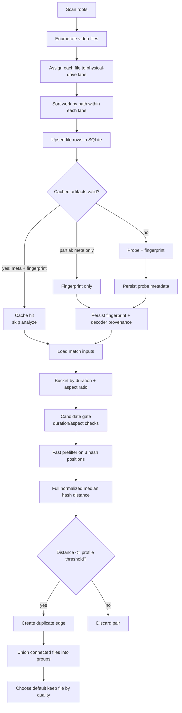
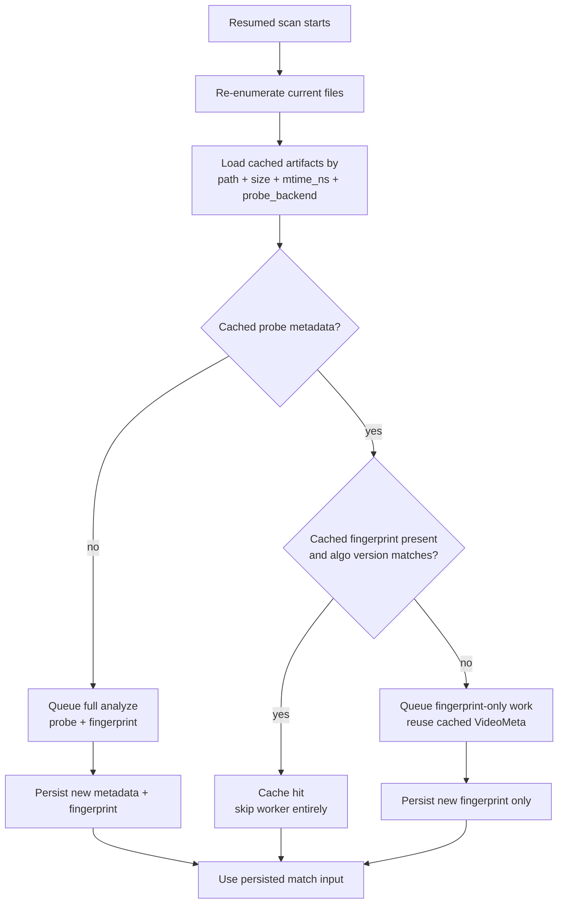

# Video Duperz

A Windows-first PySide6 app for finding perceptual duplicate videos using dhash fingerprinting, with physical drive-aware parallel scanning and quality-based keep decisions.

## Table of Contents

- [Features](#features)
- [UI Walkthrough](#ui-walkthrough)
- [Requirements](#requirements)
- [Installation](#installation)
- [Usage](#usage)
- [Configuration](#configuration)
- [Keyboard Shortcuts](#keyboard-shortcuts)
- [Menus](#menus)
- [Project Structure](#project-structure)
- [Architecture](#architecture)
- [Duplicate Detection Flow](#duplicate-detection-flow)
- [Backend Behavior and Result Quality](#backend-behavior-and-result-quality)
- [Development](#development)
- [Troubleshooting](#troubleshooting)
- [Legal Disclaimer](#legal-disclaimer)

## Features

- **Perceptual duplicate detection** - dhash (difference hash) algorithm with 12 frame samples across video duration
- **Three similarity profiles** - Conservative (0.12), Balanced (0.18, default), Aggressive (0.24) thresholds
- **Physical drive-aware scanning** - maps root folders to physical drives and allocates worker threads per drive for optimal I/O
- **Intelligent pre-filtering** - candidates filtered by duration (+-3s and 0.96 ratio minimum), aspect ratio, and hash prefilter before full distance computation
- **Quality-based keep decisions** - scores files by resolution (65%), bitrate (25%), and codec quality (10%) to determine which duplicate to keep
- **Exact match detection** - byte-level identical file detection using configurable block sampling
- **Live scan monitoring** - real-time progress per lane showing discovered/analyzed files, I/O throughput, cache hit ratios, and active file
- **Thumbnail pair caching** - extracts and caches video thumbnails at configurable frame positions
- **Duplicate group management** - decision-focused UI for bulk actions (keep best, worst, larger, smaller, newer, older)
- **Structured results filtering** - combine case-insensitive text filters with metadata filters for size, duration, similarity, resolution, codec, and HDR
- **Scan-time process priority controls** - configure parent-process CPU/background I/O mode and scan-child priority policy for probe and fingerprint subprocesses
- **Export to CSV/JSON** - duplicate groups plus tracked symlink/hardlink rows exportable for external analysis
- **Saved scan profiles** - save and restore source configurations and scan parameters
- **Saved column views** - preserve result table column layouts and visibility

## UI Walkthrough

1. Configure sources and scan profiles before indexing.

   

   Sources setup state for defining roots, extension presets, and worker settings.

2. Monitor scan progress and throughput across lanes.

   

   Workflow state for active scan progress, queue depth, and processing lanes.

3. Review duplicate groups and choose a cleanup decision.

   

   Decision-focused duplicate results state for keep/remove/export actions.

## Requirements

- **Windows** (10 or later)
- **Python 3.13+**
- **ffprobe** (from ffmpeg suite) installed and available in PATH

Runtime dependencies: `PySide6 >=6.10.2`, `numpy >=2.4.2`, `opencv-python >=4.13.0.92`.

## Installation

### First-time Setup

```bat
python scripts\windows\setup_env.py
```

Creates the `.venv` by running `uv sync --locked` (falls back to `uv sync` if no lockfile).

Manual alternative for development:

```bat
uv sync --group dev
```

Install ffmpeg if needed (Windows):

```bat
:: via package managers:
choco install ffmpeg
scoop install ffmpeg
winget install Gyan.FFmpeg
```

## Usage

### Recommended (console-less)

```bat
pyw scripts\windows\run_app_gui.pyw
```

Launches the GUI without a console window. Auto-bootstraps the `.venv` via `setup_env.py` if not yet created.

### With console

```bat
python scripts\windows\run_app.py
```

Runs via `hatch run python -m video_duperz`. Requires `hatch` in PATH.

### Direct (GUI)

```bat
python -m video_duperz gui
```

### CLI

```bat
:: Headless scan with profiles
python -m video_duperz scan --roots D:\Videos E:\Archive --profile balanced

:: Export results
python -m video_duperz export --scan-id 1 --out C:\temp\dup-report

:: Full reset (delete database, cache, and settings)
python -m video_duperz clean --full-reset

:: Full reset with relaunch
python -m video_duperz clean --full-reset --delay-ms 1500 --relaunch
```

`File > Full reset` in the GUI closes the app, runs the companion cleaner command, and relaunches after cleanup.

Global runtime overrides are available for all commands:

- `--config-dir <path>` - override QSettings INI root
- `--data-dir <path>` - override runtime data root (DB/cache/thumbnails)

### Results Filtering

The Results tab exposes a grouped filter panel above the duplicate table with an always-visible `Basic Filters` section and a collapsible `Advanced Filters` section.

- `Basic Filters`:
  - `Include Name`, `Include Path`, `Exclude Name`, `Exclude Path`
  - `Must match all`
  - `Clear Filters`
  - case-insensitive matching
  - use `|` inside one text box for OR matching, for example `sample|trailer`
  - typing waits 5 seconds before applying
  - pressing `Enter` in a text box applies immediately
- `Advanced Filters`:
  - collapsed by default each time the Results view opens
  - `Size MiB Min/Max`
  - `Duration s Min/Max`
  - `Similarity Min`
  - `Width Min`
  - `Height Min`
  - `Extension`
  - `Video Codec`
  - `HDR` with `Any`, `HDR only`, and `SDR only`

`Clear Filters` resets every basic and advanced filter at once. All filter controls share the same debounce delay when changed normally. All active filter families combine with AND semantics. Inside a single text box, `|` terms combine with OR semantics.

## Configuration

Runtime settings are stored via QSettings:

- Backend: `QSettings(IniFormat, UserScope, "ThreepSoftwz", "video_duperz")`
- Default INI path: `%APPDATA%\ThreepSoftwz\video_duperz.ini`
- Default runtime data root: `%LOCALAPPDATA%\ThreepSoftwz\video_duperz\`
- Database: `%LOCALAPPDATA%\ThreepSoftwz\video_duperz\app.db` (SQLite with WAL mode)
- OV01 overrides:
  - `CONFIG_DIR` env var or `--config-dir`
  - `DATA_DIR` env var or `--data-dir`

### Key Settings

| Setting | Description |
|---|---|
| Scan roots | Directories to scan for video files |
| File extensions | Preset groups: basic, medium, broad |
| Similarity profile | balanced / conservative / aggressive |
| Max workers | 1-16, with per-drive overrides |
| Probe worker mode | balanced / burst |
| Scan process priority | Parent and child CPU priority plus Normal / Background I/O mode during scans |
| Thumbnail size | 80x45, 96x54, 128x72, 160x90 |
| Frame extraction positions | Two percentage points for thumbnail comparison |
| Identical file matching | Block size (1-64 MiB) and sample positions |
| Keep rule strategy | Quality scoring (resolution + bitrate + codec) |
| Batch size / flush intervals | Scan pipeline tuning parameters |
| Everything path override | Optional `Everything.exe` override used by the Results shortcut |
| Custom Results commands | INI-only `custom_command_F2/F3/F4` entries that receive the current file path and parent dir |

### Export Outputs

One scan export now writes four files:

- `duplicates.csv`
- `duplicates.json`
- `links.csv`
- `links.json`

`links.csv` and `links.json` contain tracked filesystem links that were excluded from duplicate matching. Each link row includes the link kind, the link path, the target original path, whether that target existed at scan time, and the source root.

### Scan Priority Settings

The Sources tab exposes four persisted scan-time priority controls:

- `scan_parent_cpu_priority`
- `scan_parent_io_mode`
- `scan_child_cpu_priority`
- `scan_child_io_mode`

Supported CPU choices are `Idle`, `Below Normal`, `Normal`, `Above Normal`, and `High`.
Supported I/O choices are `Normal` and `Background`.

The parent settings apply only while a scan is active and are restored when the scan finishes, pauses, fails, or is cancelled. The same parent-scan policy is also applied by the headless `video-duperz scan` command.

The child settings apply only to scan-heavy subprocesses:

- `ffprobe` metadata extraction
- `ffmpeg` frame extraction used during fingerprinting
- `video-duperz fingerprint-child`

Explorer, MediaInfo, Everything, custom commands, and cleaner relaunches are intentionally unaffected.

### Recent Folders

Up to 20 recently scanned folders are stored for quick access. Saved scan profiles are limited to 200.

## Keyboard Shortcuts

| Key | Action |
|---|---|
| Delete | Soft delete selected files by renaming to `.z_dele` |
| Shift+Delete | Delete selected files to the Recycle Bin |
| Ctrl+Shift+Delete | Permanently delete selected files |
| Space | Toggle the current row checkbox |
| Tab | Jump to the next visible duplicate group |
| Shift+Tab | Jump to the previous visible duplicate group |
| Enter | Open current file in default player |
| E | Open file location in Explorer |
| C | Copy the current full path |
| S | Search the current filename in Everything |
| G | Open a web search for the current filename stem |
| M | Launch MediaInfo for selected file |
| F2 / F3 / F4 | Run the configured INI custom command with `file_full_path` and `file_parent_dir_path` |
| Ctrl+Q / Alt+X | Exit application |
| F1 | Help |

## Menus

**File**:
- Export Current Scan...
- Clear Recent Folders
- Clear Saved Scans
- Clear Cached Thumbnails
- Full Reset (destructive - launches separate cleaner process)
- Exit (Ctrl+Q, Alt+X)

**View**:
- Columns submenu:
  - Fit Columns
  - Save Current View
  - Saved Views (dynamic)
  - Per-column visibility toggles (20 columns)

**Sort** (mutually exclusive):
- Larger / Smaller size groups first
- Most / Least duplicates first
- Larger / Smaller files in group first
- Size difference (spread) DESC / ASC

**Actions**:
- Open Current File
- Explore Current File
- Copy Full Path
- Search In Everything
- Open Web Search
- Launch MediaInfo
- Run Custom Command F2 / F3 / F4
- Select all, keep best / worst / larger / smaller / newer / older
- Soft Delete Selected
- Delete to Recycle Bin
- Permanently Delete

### INI-Only Results Actions

The following settings are available only in the INI file:

- `everything_exe_path`
- `custom_command_F2`
- `custom_command_F3`
- `custom_command_F4`

When `custom_command_F2/F3/F4` are triggered from the Results tab, the app appends these two arguments to the configured command line:

- `file_full_path`
- `file_parent_dir_path`

**Tools**:
- Edit .ini File

**Help**:
- Help (F1)

## Project Structure

```text
video-duperz/
|-- pyproject.toml
|-- uv.lock
|-- src/
|   `-- video_duperz/
|       |-- __init__.py              # Package version detection
|       |-- __main__.py              # CLI entry point (gui, scan, export, clean)
|       |-- config.py                # Settings management, QSettings wrappers
|       |-- models.py                # Data classes (Settings, ScanResult, etc.)
|       |-- db.py                    # SQLite database layer
|       |-- scanner.py               # File enumeration and physical drive detection
|       |-- pipeline.py              # Scan orchestration (enumerate/probe/fingerprint/match)
|       |-- probe.py                 # Probe backends for video metadata
|       |-- fingerprint.py           # dhash computation and decoder fallbacks
|       |-- matcher.py               # Duplicate edge detection and grouping
|       |-- quality.py               # Quality scoring for keep decisions
|       |-- exact_match.py           # Byte-level identical file detection
|       |-- scan_sets.py             # Scan configuration normalization
|       |-- exporters.py             # Duplicate/link CSV/JSON export
|       |-- cleaner.py               # Full reset utility
|       `-- ui/
|           |-- main_window.py       # Main application window with menus and tabs
|           |-- scan_view.py         # Scan progress monitoring UI
|           |-- results_view.py      # Duplicate results table with actions
|           |-- thumbnails.py        # Thumbnail extraction and caching
|           `-- workers.py           # QRunnable workers for async operations
|-- scripts/
|   |-- policy/
|   |   `-- check_standard.py
|   `-- windows/
|       |-- setup_env.py              # Create/verify .venv via uv sync
|       |-- run_app.py               # Launch app via hatch run
|       |-- run_app_gui.pyw          # Launch GUI without console window
|       `-- run_tests.py             # Run tests via hatch run test
|-- docs/
|   |-- dev-packaging.md
|   `-- images/
|       |-- ui-01-overview.png
|       |-- ui-02-workflow.png
|       `-- ui-03-details.png
|-- tests/
|   |-- conftest.py
|   |-- unit/
|   `-- integration/
`-- .pre-commit-config.yaml
```

## Architecture

- `src/` layout with `video_duperz` package.
- CLI entry point (`__main__.py`) dispatches to `gui`, `scan`, `export`, or `clean` commands.
- **Scan pipeline** (`pipeline.py` + `pipeline_runtime.py`) orchestrates:
  1. **Enumerate** - discover video files, assign them to physical-drive lanes, and sort work per lane by path
  2. **Prepare / cache lookup** - upsert file rows, load cached probe/fingerprint artifacts, and skip unchanged files when possible
  3. **Analyze** - for uncached files, run probe plus fingerprint or fingerprint-only reuse work
  4. **Match** - bucket files by metadata, compare perceptual hashes, and accept duplicate edges under the selected profile
  5. **Results** - build duplicate groups and choose a default keep candidate by quality score
- **Scan process priority** (`process_priority.py`) applies optional parent-process CPU/background mode during active scans and child-process priority policy for scan-only subprocess launches.
- **Physical drive mapping** (`scanner.py`) uses Windows kernel32 APIs to map volumes to physical drives and allocate I/O workers per drive.
- **Database** (`db.py`) uses SQLite with WAL mode, aggressive PRAGMAs (mmap, cache_size, synchronous=NORMAL), and batch transaction flushing.
- **GUI threading** uses `QThreadPool` with `QRunnable`-based workers (`ScanWorker`, `ThumbnailPairWorker`, `ExactMatchGroupWorker`) communicating via Qt signals.
- **Quality scoring** (`quality.py`) combines resolution (65%), bitrate (25%), and codec quality (10%) weights.

## Duplicate Detection Flow

The app does not compare raw files directly. It builds a normalized analysis record for each video, then compares only plausible candidates.

### End-to-end flow



### What each stage actually does

| Stage | What it does | Persisted output |
|---|---|---|
| Enumerate | Walks source roots, filters by configured extensions, records file path, size, mtime, ctime, source root, and physical-drive lane. | `files` rows are upserted later during prepare. |
| Prepare | Writes/updates `files`, checks existing cached artifacts by `path + size + mtime_ns + probe_backend`, and decides between cache hit, fingerprint-only, or full analyze. | Updated `files` rows and in-memory scheduling decisions. |
| Probe | Extracts `VideoMeta`: duration, width, height, fps, codec, bitrate, audio flags/codecs/bitrates/languages, subtitle languages, and HDR flag. | `video_meta` row with `probed_at`, source file stats, and optional probe error. |
| Fingerprint | Samples 12 timestamps across the duration, decodes frames, converts them to grayscale, downsizes to `9x8` comparisons via a `32x32` intermediate, and stores 12 dhash values. | `fingerprints` row plus `fingerprint_decoder_provenance`. |
| Match | Loads persisted `MatchItem` records, buckets by coarse duration/aspect, filters candidates, then compares hash distance under the chosen profile threshold. | Duplicate edges and grouped duplicate sets. |
| Group / keep choice | Turns accepted edges into connected components and picks a default keep candidate. | `duplicate_groups` and `duplicate_items` rows. |

### What "analyze" means

In the runtime, **analyze** is the expensive per-file phase that produces the material needed for matching.

- `cache_hit`: both probe metadata and fingerprint are already valid in the database, so no worker is launched.
- `fingerprint_only`: probe metadata is already valid, so the worker reuses cached `VideoMeta` and only rebuilds the fingerprint.
- `probe_and_fingerprint`: the worker probes the file first, then fingerprints it.

This is why resumed scans can be much faster than fresh scans when files are unchanged: unchanged files are either skipped entirely or avoid re-probing.

### Resume and cache reuse flow



### What "probe" means

Probe is the metadata extraction step. It does not compare duplicates by itself; it shapes the later candidate search.

Probe data is used for:

- bucket construction: duration bucket and aspect-ratio bucket
- candidate rejection: duration difference, duration ratio, and aspect-ratio delta
- UI / export columns: resolution, codec, bitrate, HDR, audio/subtitle metadata
- default keep scoring: quality scoring uses some of the same media facts

If probe fails for a file, the runtime records a probe error and that file does not participate in matching.

### What "fingerprint" means

Fingerprint is the perceptual signature used for actual duplicate similarity.

- The app samples 12 timestamps across the video duration.
- For each sample it decodes a frame to grayscale.
- It computes a 64-bit dhash per sample.
- The matcher first does a quick median check on 3 positions.
- If that survives, it computes the normalized median Hamming distance across all 12 hashes.

Two files are considered duplicates only if that final normalized distance is at or below the active profile threshold:

| Profile | Threshold |
|---|---|
| conservative | `0.12` |
| balanced | `0.18` |
| aggressive | `0.24` |

Lower thresholds are stricter.

## Backend Behavior and Result Quality

There are two separate backend choices in the current implementation:

1. **Probe backend**: user-selectable per scan
2. **Fingerprint decoder backend**: chosen automatically per file through fallback logic

They affect different parts of the pipeline.

### Probe backends

| Probe backend | Used for | Notes |
|---|---|---|
| `pyav` | Metadata extraction only | Reads container/stream info through PyAV. |
| `ffprobe` | Metadata extraction only | Shells out to `ffprobe` and parses JSON output. |

The selected probe backend is persisted with the scan and is part of cache validity. Cached probe/fingerprint data for `pyav` does not satisfy an `ffprobe` scan, and vice versa.

### Fingerprint decoder backends

Fingerprinting always ends at the same hash representation, but the frame decoder used to obtain those frames can differ:

| Decoder backend | Used for | Notes |
|---|---|---|
| `opencv` | Fingerprint frame decode | Preferred first for normal formats. |
| `pyav` | Fingerprint frame decode fallback | Used when OpenCV is unavailable or unsuitable. |
| `ffmpeg` | Fingerprint frame decode fallback or first choice for problematic formats | Also gets a longer guarded timeout for problematic formats. |

For problematic formats (`.wmv`, `.asf`, `.avi`, `.mov`, `.mpg`, `.mpeg`, `.flv`), fingerprinting now starts with `ffmpeg` instead of `opencv`, and each decoder attempt gets a `4x` timeout.

### How backend choices affect comparison results

#### Probe backend impact

Changing the probe backend can change:

- exact duration value
- fps value
- width/height interpretation in odd containers
- bitrate and language metadata completeness
- HDR detection fields

Those differences matter because matching uses probe metadata to decide which pairs are even worth comparing. If two files end up in different duration/aspect neighborhoods, they may never reach the hash-comparison step.

So:

- the probe backend mainly affects **candidate generation and filtering**
- it can change recall/false positives indirectly
- it does **not** change the dhash algorithm itself

#### Fingerprint decoder impact

Changing the fingerprint decoder path can change:

- which exact frame is decoded near a timestamp
- how corrupted or awkward containers are tolerated
- whether a frame sample is missing or substituted

That means decoder choice can change the actual hash values, even though the final hash algorithm is still the same dhash implementation. In practice:

- stable decodes across backends usually produce very similar results
- awkward formats can produce meaningfully different hashes depending on decoder
- this is why decoder provenance is stored, and why problematic formats prefer `ffmpeg` first

### Important implementation details

- A scan compares files only within the same scan and same selected probe backend.
- Cache reuse requires matching `path`, `size`, `mtime_ns`, probe backend, and fingerprint algorithm version.
- Resume never means "freeze worker threads and continue later." It means re-enumerate, reload persisted artifacts, skip unchanged fully processed files, and continue on the same `scan_id`.
- Progress rows distinguish:
  - `cache` -> reused probe + fingerprint
  - `fingerprint` -> reused probe, rebuilt fingerprint
  - `probe` -> rebuilt metadata + fingerprint

### Why the app can report duplicates across different containers/codecs

The final duplicate decision is perceptual, not container-based.

- Probe metadata only narrows candidate pairs.
- Fingerprints compare sampled visual content.
- Grouping is based on accepted perceptual duplicate edges.

That is why files such as `.mkv` and `.mp4`, or remuxed/re-encoded copies, can still be grouped together when their sampled visual content stays close enough.

## Development

### Windows Helpers

| Script | Description |
|---|---|
| `python scripts\windows\setup_env.py` | Create/verify `.venv` via `uv sync --locked` |
| `pyw scripts\windows\run_app_gui.pyw` | Launch GUI without console window (auto-bootstraps venv) |
| `python scripts\windows\run_app.py` | Launch app via `hatch run` (requires hatch in PATH) |
| `python scripts\windows\run_tests.py` | Run test suite via `hatch run test` |

### Testing

```bat
hatch run test
```

### Benchmarking

- Internal benchmark runs should use deterministic sample planners and lane-aware scheduling.
- During tests and benchmarks, never process more than one active file at a time from the same physical drive.
- This benchmark-only contention rule does not change production `burst` behavior.

### Quality Checks

```bat
hatch run lint:all
hatch run test-cov
```

Individual checks:

```bat
hatch run lint:check
hatch run lint:fmt
hatch run lint:types
hatch run lint:policy
```

### Build

```bat
hatch build
```

For packaging and release notes, see `docs/dev-packaging.md`.

### Lockfile Workflow

```bat
uv lock
uv lock --check
```

## Troubleshooting

### ffprobe not found

The app checks for ffprobe at startup. If missing, an error dialog is shown and the app exits.

```bat
ffprobe -version
```

Install via Chocolatey, Scoop, or WinGet if needed.

### OpenCV import errors

OpenCV (`opencv-python`) is required for optimal frame extraction. If missing, a fallback numpy-based resize is used, but fingerprinting quality may be reduced.

### Database errors

SQLite WAL mode requires a filesystem that supports shared memory. PRAGMA errors on unsupported filesystems are caught and ignored. To reset the database, use `File > Full reset` or:

```bat
python -m video_duperz clean --full-reset
```

### Scan performance

- Each physical drive gets its own processing lane with independent workers.
- Reduce `Max workers` if disk I/O becomes a bottleneck.
- Use `Probe worker mode: burst` for SSDs, `balanced` for HDDs.
- Use the Sources tab `Scan Process Priority` controls when you want scans to yield more aggressively to foreground work.
- Max 64 drive workers per scan.

### Settings migration

Column width and visibility settings must match the current 20-column schema; stale payloads are ignored.

---

<!-- legal-disclaimer:start -->
## Legal Disclaimer

THIS SOFTWARE IS PROVIDED "AS IS" AND "AS AVAILABLE," WITHOUT WARRANTIES OF ANY KIND, WHETHER EXPRESS, IMPLIED, STATUTORY, OR OTHERWISE, INCLUDING, WITHOUT LIMITATION, ANY IMPLIED WARRANTIES OF MERCHANTABILITY, FITNESS FOR A PARTICULAR PURPOSE, TITLE, NON-INFRINGEMENT, ACCURACY, OR QUIET ENJOYMENT. TO THE MAXIMUM EXTENT PERMITTED BY APPLICABLE LAW, THE AUTHORS, CONTRIBUTORS, MAINTAINERS, DISTRIBUTORS, AND AFFILIATED PARTIES SHALL NOT BE LIABLE FOR ANY DIRECT, INDIRECT, INCIDENTAL, SPECIAL, CONSEQUENTIAL, EXEMPLARY, OR PUNITIVE DAMAGES, OR FOR ANY LOSS OF DATA, PROFITS, GOODWILL, BUSINESS OPPORTUNITY, OR SERVICE INTERRUPTION, ARISING OUT OF OR RELATING TO THE USE OF, OR INABILITY TO USE, THIS SOFTWARE, EVEN IF ADVISED OF THE POSSIBILITY OF SUCH DAMAGES. THIS SOFTWARE HAS BEEN DEVELOPED, IN WHOLE OR IN PART, BY "INTELLIGENT TOOLS"; ACCORDINGLY, OUTPUTS MAY CONTAIN ERRORS OR OMISSIONS, AND YOU ASSUME FULL RESPONSIBILITY FOR INDEPENDENT VALIDATION, TESTING, LEGAL COMPLIANCE, AND SAFE OPERATION PRIOR TO ANY RELIANCE OR DEPLOYMENT.
<!-- legal-disclaimer:end -->
